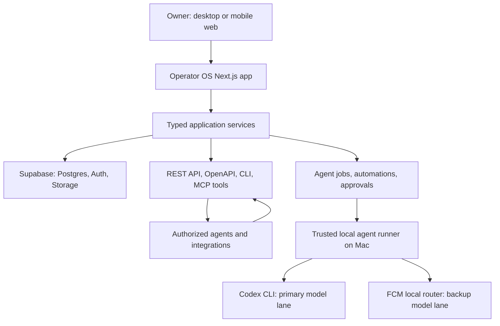

Operator OS — Definitive Product Guide & PRD

Status: Build contract

Product type: Internal, agent-native business operating system for an AI implementation business serving local service businesses, operators, and owners.

Primary outcome: One secure system in which the owner, an authorized CLI, or authorized AI agents can run the complete business journey without duplicating information across unrelated tools.

────────

1. Product definition

Operator OS is the central command center for prospecting, sales, delivery, client management, internal operations, automation, and AI-assisted execution.

It is designed around the complete operating lifecycle:

```text
Lead → Research → Contact → Outreach → Qualification → Opportunity
→ Follow-up → Proposal → Won Deal → Client → Implementation Project
→ Tasks & Milestones → Completion → Ongoing Client Success
```

The product is agent-native beneath the interface and owner-controlled above it.

• The owner can perform every operation manually from desktop or mobile.
• Every meaningful operation is also available through a stable backend service, REST API, CLI, and agent tool layer.
• Agents act through those same validated operations; they do not need to click the dashboard or receive direct database credentials.
• The owner controls permissions, budgets, autonomy, approvals, runners, integrations, and an emergency stop.

Operator OS is not an attempt to recreate Salesforce, HubSpot, ClickUp, Apollo, Monday, Zapier, and an AI-agent platform all at once. It is a single cohesive operating product whose features are only included when they reinforce this business lifecycle.

2. Product principles

1. One source of truth. A company, contact, opportunity, client, project, task, message, and activity are represented once and linked everywhere they are relevant.
2. Agent-native, not agent-dependent. A human can always complete or override work. Agents have proper tools, structured data, and permissions rather than brittle UI automation.
3. Owner remains in charge. No agent can elevate its own authority, remove auditing, change protected policies, expose secrets, or make irreversible external changes without configured approval.
4. Mobile is first-class. This is a responsive web application and installable PWA—not a separate native mobile app. Mobile workflows are designed intentionally, not squeezed from desktop tables. Desktop and mobile are equally capable, with separately authored layout components whenever their interaction patterns differ.
5. Simple architecture beats clever architecture. One TypeScript application, one managed Postgres database, a clear API, and a Postgres-backed job model. No premature microservices, Kubernetes, or distributed event bus.
6. Explainable automation. Every recommendation and AI action must show the agent, evidence, inputs, model, output, approval state, and final result.
7. Fast to build, safe to extend. Use familiar tools, clean naming, typed contracts, migrations, reusable components, and predictable APIs so AI coding agents can reliably improve the codebase.

3. Confirmed technology decisions

|Area            |Decision                                                                                                               |Reason                                                                                                                 |
|----------------|-----------------------------------------------------------------------------------------------------------------------|-----------------------------------------------------------------------------------------------------------------------|
|Web app         |Next.js App Router + TypeScript                                                                                        |One codebase for UI, server actions, route handlers, and deployment.                                                   |
|UI              |Tailwind CSS + shadcn-style components using Base UI                                                                   |Fast, accessible, reusable, and aligned with Square UI’s current Base UI direction.                                    |
|Design system   |A first-party Linear-derived token layer, enforced through CSS variables and Tailwind semantic utilities               |Preserves a precise, dense visual language while keeping components consistent and easy for AI coding agents to extend.|
|Visual reference|Square UI task-management as the visual/component base; Circle as an interaction and information-architecture reference|Reuse strong patterns without merging conflicting repositories.                                                        |
|Database        |Supabase Postgres                                                                                                      |Managed relational database with migrations, authentication, storage, and RLS.                                         |
|Auth            |Supabase Auth                                                                                                          |Secure owner login now; memberships and roles later without re-platforming.                                            |
|Files           |Supabase Storage                                                                                                       |Secure attachments linked to business records.                                                                         |
|Backend         |Next.js service layer, server actions, and versioned route handlers                                                    |The UI and agents call the same business operations.                                                                   |
|Validation      |Zod at all API and form boundaries                                                                                     |Clear, typed, predictable contracts.                                                                                   |
|Deployment      |Vercel + Supabase                                                                                                      |Minimal deployment infrastructure.                                                                                     |
|Background work |Postgres-backed `agent_jobs` and `automation_runs` claimed by trusted workers                                          |Durable enough for this product without a second queue service.                                                        |
|API             |`/api/v1` REST API + OpenAPI specification                                                                             |Stable CLI, integration, and agent surface.                                                                            |
|Agent tools     |REST first; compact MCP server and `ops` CLI generated from the same application services                              |Compatible with future agents while keeping one source of truth.                                                       |
|Observability   |Structured audit records, application logs, job/run logs, integration health, and model execution records              |Required for safe agent operations.                                                                                    |

Repository strategy

Create a new private production repository. Do not literally merge Circle, Square UI, or ai-crm-agents repositories.

• Adapt Square UI Base UI patterns and selected source components.
• Recreate Circle’s best navigation, dense record layouts, list/board behavior, command palette, and project patterns in the approved component foundation.
• Treat ai-crm-agents as a source of agent workflow ideas only. Its generic/placeholder Python implementation is not the production backend.
• Keep the repository private while it contains Square UI-derived code, in accordance with its source-available licensing conditions.

4. Design language and interaction standard

Operator OS uses a Linear-inspired dark operating-system design language: fast, dense, precise, and engineered. This is the binding visual standard for Figma Make output and production implementation. It overrides any conflicting visual detail inherited from Square UI, Circle, or generated components.

4.1 Token contract

Define these as semantic CSS variables in a single tokens.css file, then expose them through Tailwind. Components must use semantic tokens such as surface-raised, text-secondary, and border-subtle; they must not introduce one-off color, radius, shadow, type, spacing, or motion values.

|Category            |Token values                                                                                                                                                                                             |
|--------------------|---------------------------------------------------------------------------------------------------------------------------------------------------------------------------------------------------------|
|Canvas and elevation|Canvas `#08090a`; elevation ladder `#0f1011`, `#141516`, `#1c1c1f`, `#232326`, `#28282c`.                                                                                                                |
|Borders and depth   |Hairline border `#23252a`; subtle separator/shadow equivalent `#ffffff0d`. Depth comes from tonal layers and translucent separators, not heavy drop shadows.                                             |
|Text                |Primary `#f7f8f8`; secondary `#d0d6e0`; tertiary `#8a8f98`; muted `#62666d`.                                                                                                                             |
|Chrome accent       |Indigo `#5e6ad2` only for primary buttons, active navigation, selected controls, and focus ring `rgba(94,106,210,.25)`. Violet `#7170ff` only for links.                                                 |
|Status semantics    |Yellow `#f0bf00`, green `#27a644`, red `#eb5757`, blue `#3caefe` only for issue-state dots, priority icons, and explicit status indicators—not general chrome.                                           |
|Typography          |Inter only. Optical weights `400`, `510`, `590`, `680`; titles use `590`, never conventional bold. Body is `15px/1.6`; rows, labels, and dense metadata are `13px/510`. Never use `500`, `600`, or `700`.|
|Shape and scale     |Four-pixel spacing base. Sidebar rows radius `6px`; buttons, fields, and compact controls radius `8px`; command menu radius `12px`.                                                                      |
|Motion              |CSS-native `100–160ms` ease-out-quad transitions. No springs, bounce, slow fades, or decorative animation. Honor reduced-motion preferences.                                                             |

4.2 Desktop operating shell

• Use a persistent 220px sidebar. Navigation rows are 28px tall with 6px radius, #232326 hover, indigo active state, and compact section labels.
• Use dense keyboard-first controls: 32px buttons and inputs, 32–38px issue/record rows, and #ffffff0d row dividers. A full row hovers at #141516.
• Make the command menu (⌘K) a primary interface, not a decorative feature: #1c1c1f surface, 12px radius, layered low shadow, keyboard navigation, and visible kbd chips for shortcuts.
• Keep record pages, tables, boards, timelines, and side panels information-dense but scannable. Use whitespace deliberately; do not make the product airy or card-heavy.
• Use color only where it communicates meaning. Selection, focus, and primary action use indigo; status colors must retain their semantic meaning.

4.3 Responsive architecture: different but equally complete

The owner has two co-primary experiences: desktop for deep work and mobile for live operation. Mobile is never a reduced-functionality variant.

|Band                  |Rule                                                                                                                                                        |
|----------------------|------------------------------------------------------------------------------------------------------------------------------------------------------------|
|Mobile `<640px`       |Authored mobile-first layouts for real-world operating work. Use lists, bottom sheets, focused editors, thumb-reachable actions, and explicit move controls.|
|Tablet `640–1024px`   |Retain the mobile interaction tree with more breathing room.                                                                                                |
|Desktop `1024–1200px` |Transition into dense desktop surfaces where the task benefits from panels, tables, and persistent navigation.                                              |
|Wide desktop `1200px+`|Authored primary desktop experience for the owner’s multi-panel deep work.                                                                                  |

Do not build one component that attempts to serve divergent mobile and desktop workflows through large collections of breakpoint modifiers. When the interaction changes materially—such as dashboard, record management, kanban, project timeline, or complex filters—create separate desktop and mobile layout components that share data contracts and design tokens. This structural rule preserves mobile quality over time.

4.4 Component quality gate

Before any component is accepted, verify that it:

• Uses the token contract rather than hard-coded visual values.
• Supports keyboard navigation, visible focus, and sensible screen-reader labels.
• Has a mobile-native interaction pattern where required; touch targets are at least 44px for primary mobile actions.
• Uses short, purposeful transition states only.
• Contains no heavy shadow, generic gradient, oversized rounded card, rainbow status chrome, or conventional bold treatment.

5. System architecture



The one-operation rule

Every important action is a service operation with a single authoritative implementation. For example, moving an opportunity uses the same moveOpportunityStage() service whether it was initiated by the pipeline board, ops CLI, a REST call, Hermes, Codex, or an automation.

That operation validates input, enforces scope and approval policy, writes the business change, logs an immutable activity, emits permitted webhook events, and returns structured output.

6. Roles, authority, and permission model

Owner

The owner has end-to-end authority over all records, agents, integrations, API keys, models, policies, exports, and emergency controls.

Protected rules:

• An agent cannot remove or demote the owner.
• An agent cannot increase its own scope, create a privileged replacement, disable audit history, or change protected security policy.
• No agent receives direct database credentials.
• Secrets are never returned through ordinary UI, API, agent context, activity logs, or model prompts.

Future human roles

|Role                 |Intent                                                                         |
|---------------------|-------------------------------------------------------------------------------|
|Owner                |Full control and policy administration.                                        |
|Operator             |Runs sales and delivery work; cannot change protected security or agent policy.|
|Sales collaborator   |Works leads, contacts, opportunities, outreach, and meetings.                  |
|Delivery collaborator|Works clients, projects, tasks, files, and project updates.                    |
|Read-only advisor    |Can inspect authorized records without mutations.                              |

Agent identities

Every agent has an identity, immutable ID, scoped token, declared capabilities, autonomy policy, run budget, expiration, and audit history.

Representative scopes:

```text
leads:read              leads:write
companies:read          contacts:read
opportunities:read      opportunities:move_stage
tasks:create            tasks:update
outreach:draft          outreach:send:approval-required
projects:create         projects:update
files:attach            activities:read
records:delete:denied   settings:owner-only
```

7. Complete information architecture

Desktop sidebar

```text
TODAY
  Today
  My Work
  Notifications

SALES
  Sales Overview
  Leads
  Companies
  Contacts
  Pipeline
  Outreach
  Inbox
  Meetings
  Proposals

DELIVERY
  Clients
  Projects
  Tasks
  Calendar
  Files
  Knowledge

INTELLIGENCE
  Intelligence Center
  Agents
  Approvals
  Automations
  Model Routing

OPERATIONS
  Activity
  Reports
  Integrations
  Developer
  Settings
```

Mobile navigation

```text
Today | Sales | Work | Agents | More
```

The mobile quick-action control offers: add lead, add task, log note, log call, draft outreach, upload file, run agent, and ask agent.

8. Functional product modules

7.1 Today and My Work

Today is the daily command center. It includes a business briefing, approval requests, overdue tasks, follow-ups due, new outreach replies, at-risk deals and projects, upcoming meetings, active client work, integration failures, recent agent activity, and fast capture.

My Work includes personal tasks, agent-assigned tasks, follow-ups, approvals, overdue items, waiting items, and calendar/list/board views.

7.2 CRM

The CRM contains Leads, Companies, and Contacts. It supports saved views, filters, bulk operations, tags, custom fields, imports, exports, duplicate detection, merging, notes, files, related records, and activity history.

A company is the canonical business record. A client is a company with lifecycle_status = active_client; do not duplicate it into a separate customer/account table.

7.3 Sales

Sales includes Sales Overview, Pipeline, Opportunity Detail, Outreach, Inbox, Meetings, Proposals/Quotes, and a Services/Offers catalog.

Pipeline views:

```text
Board | List | Forecast
```

Default pipeline stages:

```text
New Opportunity → Qualified → Discovery → Solution Defined
→ Proposal Sent → Negotiation → Won → Lost
```

Every opportunity requires a clear next action, owner, stage, company, primary contact, expected value, expected close date, and activity history.

7.4 Outreach and inbox

Outreach is connected to leads, contacts, companies, and opportunities—not a disconnected email tool.

It includes a queue, drafts, scheduled messages, sent messages, replies, follow-ups due, awaiting response, bounces, unsubscribe state, templates, and sequences.

Initial sending policy: agents can research, score, classify, draft, and prepare follow-ups. Sending external messages requires owner-configured approval. The first production version can record manual sends before a Gmail/Outlook integration is enabled.

7.5 Meetings, proposals, and commercial operations

Meetings manage discovery calls, demos, follow-ups, and client meetings with agendas, preparation briefs, notes, outcomes, recordings/transcripts, and resulting tasks.

Proposals and quotes include drafts, internal approval, sent, viewed, accepted, rejected, and expired states. They connect an opportunity to services, scope, deliverables, price, timeline, terms, files, and activity.

Operator OS tracks contract and payment status but deliberately does not build full accounting. Accounting and payments remain integrations.

7.6 Client delivery

Projects are created from won opportunities and retain the original commercial context.

Project views:

```text
Board | List | Timeline
```

Project states:

```text
Planned | Active | Waiting on Client | Blocked | Quality Review | Completed
```

Project task states:

```text
Backlog | Ready | In Progress | Waiting | Review | Done
```

Each project contains scope, deliverables, health, phases, milestones, dependencies, risks, blockers, decisions, client contacts, files, notes, activity, and agent recommendations. Project templates create repeatable implementation plans for common AI engagements.

7.7 Kanban, timeline, calendar, and activity

Kanban is a first-class view for opportunities, projects, and tasks. Desktop supports drag-and-drop; all surfaces also include explicit move controls. Mobile never depends on dragging.

Two different timeline experiences are required:

1. Activity timeline: chronological record history for the entire workspace and for every company, contact, opportunity, client, and project.
2. Project timeline: date-based phases, milestones, tasks, dependencies, approval points, blockers, current-day marker, and progress. Mobile provides a vertical phase and milestone alternative.

Calendar supports day, week, month, and agenda views for meetings, tasks, follow-ups, outreach scheduling, milestones, and deadlines.

7.8 Files and knowledge

Files are stored once, tagged, associated with records, searchable, and visible in related views. The knowledge area holds SOPs, sales playbooks, implementation templates, offers, client documentation, and agent instructions. Knowledge can be deliberately attached to an agent; it is not silently injected into all prompts.

9. AI agent system

The agent system is a product capability, not a third-party repo pasted into the app.

Initial agent templates

|Agent                              |Primary purpose                                                                |
|-----------------------------------|-------------------------------------------------------------------------------|
|Executive Operations Agent         |Creates daily briefs, priorities, and exception summaries.                     |
|Lead Research & Qualification Agent|Researches/qualifies leads using verifiable evidence.                          |
|Outreach Agent                     |Drafts personalized outreach, classifies replies, suggests next actions.       |
|Sales Pipeline Agent               |Detects stale/risky deals, recommends actions and forecasts.                   |
|Meeting Agent                      |Builds briefs, agendas, notes, outcomes, and follow-ups.                       |
|Implementation Project Agent       |Creates plans, monitors delivery risks, and prepares project updates.          |
|Client Success Agent               |Monitors relationship/delivery health and expansion opportunities.             |
|Analytics Agent                    |Explains material changes and produces operational reports.                    |
|Data & Automation Agent            |Finds duplicates, incomplete records, workflow failures, and data-quality gaps.|

Customization

Agents are fully customizable. The owner can duplicate a template or create an original agent and configure:

• Name, purpose, responsibilities, and operating instructions
• Tools and data scopes
• Autonomy level and approval requirements
• Triggers, schedules, business hours, and escalation rules
• Knowledge sources
• Preferred model and fallback route
• Output schema and formatting
• Usage budget, action limits, and notification preferences

Agent configuration is versioned. A prior run retains the exact configuration, policy, model, tools, and inputs that were used.

Autonomy levels

|Level            |Meaning                                                              |
|-----------------|---------------------------------------------------------------------|
|Observe          |Read records and provide reports only.                               |
|Suggest          |Recommend actions without changing data.                             |
|Draft            |Create drafts, proposed tasks, and approval requests.                |
|Act within policy|Execute explicitly permitted, reversible actions.                    |
|Operate workflow |Own a defined multi-step workflow within scope and escalation limits.|

Default safety posture:

• Research, scoring, task creation, and health updates may be automatic if their evidence is recorded.
• Drafting messages is automatic.
• Sending external messages, changing commercial status, spending money, deleting information, changing integrations, or changing permissions requires owner approval or is denied.

Agent control plane

The UI contains an Agent Directory, Agent Detail, Test Lab, Agent Runs, Approval Queue, Automation builder, Model Routing page, agent performance, and emergency controls.

Every run stores: assignment, initiator, plan, checkpoints, tool calls, records accessed, proposed actions, approvals, result, error, retry history, executor, model, fallback events, estimated usage, and activity references.

10. Codex primary lane and FCM backup lane

Correct relationship

Free Coding Models (FCM) is a router/catalog for provider-backed free or free-limited models. It is not a way to upload or proxy a ChatGPT/Codex subscription.

The supported design is:

```text
Hosted Operator OS creates a bounded job
→ trusted local runner on the Mac claims the job
→ runner tries Codex CLI using the owner’s normal ChatGPT login
→ runner uses FCM only when fallback policy permits
→ runner posts validated structured results through Operator OS API
```

Codex remains authenticated locally. Its session credentials are never stored in the hosted app, Supabase, Vercel environment variables, FCM, GitHub, prompts, or activity logs.

Routing policies

Create two named FCM sets:

• coding-backup: high-quality models for repository work and technical tasks.
• business-backup: strong instruction-following models for structured business analysis, drafting, and classification.

Fallback occurs only for an explicit request, quota exhaustion, transient rate limit, temporary service failure, or safe timeout. A fallback must not bypass denied permissions, safety restrictions, approval requirements, or data validation.

Every model execution records the requested task class, executor, provider/model, latency, fallback cause, input/output references, token/usage estimates, and success/failure status.

Runner availability

The hosted product remains usable even when the Mac is offline. It can handle normal CRM, sales, project, approval, and web workflows without the local runner.

The local runner is required for local-only operations, FCM routing, and repair tasks that need the Mac. The UI clearly reports runner health such as:

```text
Codex Cloud: Available
Mac Runner: Offline
FCM Router: Unreachable
Hermes: Connected
GitHub: Connected
Gmail: Connected
```

The platform must never pretend that an offline computer, unavailable Tailscale connection, or unreachable local FCM daemon is operational. It proposes the next safe recovery path instead.

Local FCM security

FCM stays localhost-only:

```text
FCM_HOST=127.0.0.1
FREE_CODING_MODELS_TELEMETRY=0
```

Do not expose its router port directly to the public internet or Tailscale. Use eco probe mode initially because model probes consume free-tier provider quota. Provider API keys live only on the trusted local machine.

11. API, CLI, MCP, webhooks, and integrations

REST API

The API is versioned at /api/v1 and has typed validation, scopes, idempotency keys for writes, structured errors, rate limits, OpenAPI documentation, and audit logging.

Core resources:

```text
/leads          /companies       /contacts       /opportunities
/outreach       /meetings        /proposals      /clients
/projects       /tasks           /notes          /files
/activities     /automations     /agents         /agent-jobs
/agent-runs     /approvals       /integrations   /api-keys
/webhooks       /reports         /search
```

CLI

The first-party ops CLI uses the same API and supports:

```bash
ops today
ops leads list
ops lead create
ops opportunity move <id> --stage proposal
ops outreach draft --contact <id>
ops project create --opportunity <id>
ops task complete <id>
ops agent run <agent-id>
ops approvals list
ops activity inspect --company <id>
```

MCP and external agents

MCP tools are a compact convenience layer over the same operations, not a separate business backend. An agent discovers available tools, scopes, schemas, and errors from the product contract.

Webhooks and integrations

Webhooks are signed, retry-safe, observable, and tied to integration health. Initial connectors include Gmail/Outlook, Google/Outlook Calendar, Slack, GitHub, local runner/Tailscale status, and generic webhooks. Add external systems only through the Integration Center and scoped credentials.

12. Core data model

Identity and workspace

• workspaces
• profiles
• memberships
• roles
• permissions
• api_keys

CRM and sales

• leads
• companies
• contacts
• pipeline_stages
• opportunities
• services
• proposals
• contracts
• outreach_threads
• outreach_messages
• outreach_templates
• outreach_sequences
• sequence_enrollments
• meetings

Delivery and knowledge

• projects
• project_templates
• project_template_tasks
• milestones
• tasks
• task_dependencies
• notes
• attachments
• knowledge_documents

Shared operations

• activities
• notifications
• tags
• record_tags
• custom_field_definitions
• custom_field_values
• saved_views
• imports
• exports

Agents and automation

• agent_identities
• agent_configuration_versions
• agent_capabilities
• agent_knowledge_sources
• agent_jobs
• agent_runs
• agent_steps
• agent_actions
• approval_requests
• automation_rules
• automation_runs
• model_executions
• runner_statuses

Governance and integrations

• integrations
• integration_events
• webhook_endpoints
• webhook_deliveries
• audit_logs

Relationship rules

• A lead is an unqualified prospect. It can convert into a company, contact, and opportunity.
• A company has many contacts, opportunities, projects, notes, tasks, files, and activities.
• A contact belongs to one company initially and participates in outreach, meetings, opportunities, and tasks.
• An opportunity belongs to a company, has a primary contact, and may produce a project when won.
• A client is a company in an active-client lifecycle state.
• A project belongs to a client company and optionally tracks the originating opportunity.
• A task has one primary parent for clarity, plus optional filters/links to related company/contact/opportunity/project.
• Activities are append-oriented universal history entries with actor attribution.

All externally accessible tables use row-level security. Every row is workspace-scoped. Service-role credentials are server-only and never shipped to the browser.

13. Mobile/PWA requirements

Operator OS is desktop-first for deep work and mobile-first for real-world operation. These are co-primary, equally complete experiences—not a desktop app with a responsive fallback.

Mobile requirements:

• Installable PWA where supported.
• Five-item bottom navigation and a quick-action control.
• Full-width forms, bottom sheets, sticky primary actions, and 44px minimum primary touch targets.
• Mobile record headers with tap-to-call, tap-to-email, note capture, photo/file upload, and one-tap task completion.
• Desktop multi-column record views and tables transform into focused list → bottom-sheet editor flows, not narrowed tables.
• Kanban supports swipeable columns and an explicit move menu; drag is optional and never required.
• Project timelines have a vertical mobile alternative.
• Mobile Approvals are usable with one hand.
• Voice-dictation-friendly note capture.
• Draft preservation, retry-safe submissions, clear offline state, optimistic UI only for safe operations, and reduced cellular payloads.
• No critical feature may depend on hover, drag-and-drop, or a desktop-only panel.
• Mobile and desktop layouts are separate components when their interaction model changes; they share services, contracts, and design tokens only.

14. Security, reliability, and audit requirements

1. Supabase RLS on every exposed table with workspace ownership checks.
2. No service_role credentials, model-provider credentials, FCM keys, Codex credentials, or integration refresh tokens in browser code.
3. Every mutation validates input with Zod and writes actor/source attribution.
4. Write APIs require idempotency keys where client/agent retries could duplicate work.
5. Agent jobs use claims/leases, heartbeats, checkpoints, and safe retries.
6. External sends, financial actions, deletion, role changes, and integration changes require explicit policy checks.
7. Audit entries cannot be edited through normal product APIs.
8. Integration and runner health is visible and alerting is actionable.
9. CSV imports have preview, validation, duplicate handling, rollback metadata, and user confirmation.
10. Export and backup paths are available to the owner.

15. Four build phases

All phases are committed parts of the product. Sequencing keeps the implementation usable and testable at every milestone; it does not remove the final scope.

Phase 1 — Foundation, CRM, and command center

Build the production repository, auth, workspace, tokenized Linear design system, desktop/mobile shell, Today, My Work, leads, companies, contacts, tasks, notes, files, global activity, search, command palette, base API, RLS, and audit infrastructure. Create authored desktop and mobile shell/layout components, the ⌘K command menu, keyboard shortcuts, focus states, and the component quality gate before building page variants.

Usable outcome: real prospect and task management in one place, from desktop or mobile.

Phase 2 — Sales and delivery operations

Build sales overview, opportunity pipeline, Kanban/list/forecast, outreach, inbox, meetings, calendar, proposals, services catalog, clients, projects, project board/list/timeline, milestones, dependencies, project templates, knowledge, and reports.

Usable outcome: real lead-to-client-to-completed-project operation in one system.

Phase 3 — Programmatic and governance layer

Build API keys, OpenAPI docs, ops CLI, MCP tools, webhooks, Integration Center, imports/exports, saved views, roles/scopes, approval queue, automations, runner status, and developer center.

Usable outcome: approved CLIs, scripts, agents, and integrations can safely perform the same work as the UI.

Phase 4 — Agent-native execution

Build agent templates/customization, agent jobs/runs, Test Lab, model routing, Codex local runner integration, FCM fallback policy, agent performance, daily intelligence, research/qualification, outreach, pipeline, meetings, project, client-success, analytics, and data-quality workflows.

Usable outcome: customizable agents can take over authorized operational work while the owner retains approval and audit control.

16. Acceptance criteria for product completion

The product is not “done” because a dashboard exists. It is complete when:

• Every navigation item maps to a functional production route.
• A lead can become a company, contact, opportunity, client, project, and completed engagement without re-entering core facts.
• Sales pipeline Kanban, project Kanban, task Kanban, project timeline, calendar, and activity timelines work.
• CRM records, outreach, meetings, proposals, project delivery, files, and knowledge remain connected.
• The UI is deliberate on desktop and mobile, with complete mobile-native equivalents for every owner workflow.
• All UI components conform to the approved Linear token contract: Inter optical weights only, dark elevation ladder, indigo-only chrome, semantic status colors, dense sizing, hairline depth, and short CSS-native motion.
• Every important action is available through the UI and the protected backend operation.
• The REST API, ops CLI, MCP surface, webhooks, and agent identities are documented and scope-enforced.
• Agents are configurable, versioned, auditable, budgeted, and subject to approvals.
• Codex primary execution and FCM backup execution are visible, safe, and do not expose credentials.
• Runner, integration, automation, and agent failures are visible and recoverable.
• RLS, validation, audit, idempotency, export, and backup requirements are verified.
• The primary end-to-end workflows are tested on desktop and mobile.

17. Immediate next actions

1. Use the approved Figma Make prompt with Section 4: Design language and interaction standard included verbatim as the visual and interaction constraint; generate and review the complete interactive frontend direction.
2. Create the private Operator OS repository and initialize the agreed stack.
3. Commit this guide alongside five implementation controls:

```text
PRODUCT_SPEC.md
PAGE_INVENTORY.md
DATA_MODEL.md
PERMISSIONS_MATRIX.md
AGENT_ARCHITECTURE.md
BUILD_PLAN.md
```

4. Implement Phase 1 against this guide, with testable acceptance criteria before proceeding to Phase 2.

────────

Final product statement

Operator OS is a responsive, agent-native operating system for an AI implementation business. It centralizes CRM, sales, outreach, proposals, client delivery, projects, tasks, files, knowledge, operations, automations, and reporting in one connected data model. Its owner can run every workflow manually from desktop or mobile, while customizable AI agents, CLIs, scripts, and integrations can execute authorized work through a secure and auditable API-first foundation.